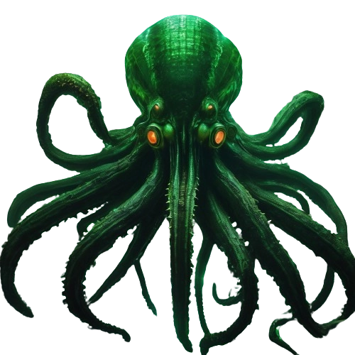

# Kraken

## Web Crawler System with Laravel 10 + Docker + Telescope + Debugar + AdminLTE3 + DataTables server side + Spatie ACL

### Resources

-   Users module

### Usage

-   `cp .env.example .env`
-   Edit .env parameters
-   `alias sail='[ -f sail ] && sh sail || sh vendor/bin/sail'`
-   `sail composer install`
-   `sail artisan key:generate`
-   `sail artisan jwt:secret`
-   `sail artisan storage:link`
-   `sail artisan migrate --seed`
-   `sail npm install && sail npm run dev`
-   `sail stop`

-   `docker-compose exec laravel.test bash`

#### Programmer login

-   user: <programador@base.com>
-   pass: 12345678
